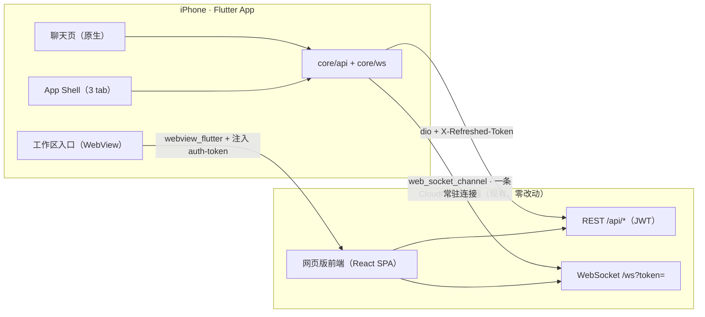

# Cloud CLI Mobile（Flutter iPhone App）设计文档

- 日期：2026-09-21
- 状态：待用户评审（视觉稿已认可）
- 设计稿（临时，未入库）：`/var/folders/_q/10fsx4hx3zs75n920sd_hz6w0000gn/T/opencode/cloudcli-mobile-design/index.html`
- 目标仓库：`claudecodeui`（origin = `huaizuo2022/claudecodeui`，upstream = `siteboon/claudecodeui`）

## 1. 为什么做

现有网页版在手机上聊天有两个具体痛点：

1. **上下滑难受** —— 流式输出时网页用 `scrollIntoView` 抢滚动位，手指一碰就被拽回底部。
2. **翻历史不方便** —— 长会话里找某一轮提问只能靠手滑。

结论：不在网页上继续修，做一个原生 Flutter App。聊天页原生重写，其余功能先用 WebView 兜底。

## 2. 范围

### 2.1 v1 做

| 能力 | 说明 |
| --- | --- |
| 登录 / 服务器配置 | 服务器地址 + 用户名密码；token 进 Keychain；7 天 JWT 自动续期 |
| 会话列表 | 项目筛选、最近会话、运行中标记、实时增量（`session_upserted`）、本地搜索 |
| 聊天（原生） | 流式输出、Markdown + 代码高亮 + 复制、思考折叠、工具调用卡、授权卡、停止运行、历史分页、会话目录跳转、跳到最新 |
| 新建会话 | 选项目 + provider → 建会话 → 首条消息 |
| 工作区（WebView 兜底） | 终端、文件、Git/Worktree、Task Master、浏览器入口，全屏内嵌网页版并直达对应 tab；MCP/插件无独立 tab，进网页后手动切 |
| 设置 | 服务器、账号、外观（深色优先）、字号、工具卡默认折叠、自动跟随、前台通知开关 |

### 2.2 v1 不做（YAGNI）

- 后台推送（APNs 需要付费开发者账号）→ 只做前台本地提示（`flutter_local_notifications`）
- 原生终端 / PTY、原生文件编辑、原生 Git 面板
- 附件与图片发送（服务端 `/api/assets/images`、`/api/assets/files` 已就绪，排 v1.1）
- 排程消息、语音输入、Task Master 原生、插件管理
- 上架 App Store、iPad 适配、浅色主题（只留 token 位）
- **不改后端**：v1 零服务端改动，全部走现有 REST + `/ws`

## 3. 已确认决策

| 决策 | 结论 | 来源 |
| --- | --- | --- |
| 形态 | 聊天原生 + 其余 WebView 兜底 | 用户选定 |
| 分发 | 自用，Xcode 直装（免费签名，7 天过期需重装） | 用户选定 |
| 视觉 | 重新设计一套 App 风格，深色优先；6 屏设计稿已认可 | 用户选定 |
| 代码位置 | 本仓库新增 `mobile/` 子目录 | 本方案建议（可改） |
| 后端 | 零改动 | 本方案建议 |
| 状态管理 | Riverpod（手写 provider，不用代码生成） | 本方案建议 |
| 路由 | 原生 `Navigator` + `IndexedStack` 三 tab，不引 `go_router` | 本方案建议 |

## 4. 架构



要点：

- **一条 App 级 WebSocket**，对齐服务端设计（一个 socket 承载所有实时事件，`connectedClients` 广播 `session_upserted` / `loading_progress`）。聊天页只是往这条连接上 `chat.subscribe`，不自己开连接。
- **run 属于服务端**：App 切后台、断线、杀进程都不影响正在跑的任务；回前台用 `lastSeq` 补帧即可。
- WebView 与原生共用同一份 token（注入 `localStorage['auth-token']`），不做第二套登录态。

## 5. 技术选型

版本号在 M1 `flutter pub add` 时以当时最新稳定版锁定（下表为写作时的大版本预期，不写死 patch）。

| 依赖 | 大版本 | 用途 | 选它的理由 / 备选 |
| --- | --- | --- | --- |
| `flutter_riverpod` | ^2.6 | 状态管理 | 编译期安全、可脱离 widget 测试；比 bloc 少样板。备选：provider（太薄）、bloc（重） |
| `dio` | ^5.7 | REST 客户端 | 拦截器天然适合 token 注入、`X-Refreshed-Token` 抓取、401 统一处理 |
| `web_socket_channel` | ^3.0 | WebSocket | 官方维护，`ws`/`wss` 通吃 |
| `gpt_markdown` | ^1.3.0 | Markdown 渲染 | 专为流式 AI 输出设计（settled 段复用、tail 增量），内置代码高亮（`highlight`）、代码复制按钮、`SelectionArea` 兼容；1.3.0 两天前刚发版，活跃。备选：`flutter_markdown`（已停维护）、`markdown_widget` |
| `highlight` | ^0.7 | 代码高亮 | `gpt_markdown` 已依赖，自定义代码块直接复用，不额外引 `flutter_highlight` |
| `flutter_secure_storage` | ^9.2 | token 存储 | iOS Keychain |
| `shared_preferences` | ^2.3 | 设置存储 | 服务器地址、外观、开关 |
| `webview_flutter` | ^4.10 | 网页兜底 | 官方；需要 `onPageStarted` 时注入 JS |
| `flutter_local_notifications` | 最新稳定 | 前台本地提示 | M4 才引，可选 |
| `scrollable_positioned_list` | ^0.3 | 目录跳转 | 支持 `reverse` + `jumpTo(index)`，避免手算偏移。备选：自己按估算高度 `jumpTo`（见风险表） |
| `intl` | ^0.20 | 相对时间 | 「3 分钟前」 |
| `flutter_lints` | 跟随模板 | 静态检查 | `flutter analyze` 进 CI 前置 |

不引入：`go_router`（v1 无深链）、`drift/isar`（v1 不做本地消息库）、`freezed/json_serializable`（手写 `fromJson`，字段少、少一层代码生成）。

## 6. 目录结构

```
mobile/
  ios/                                  # flutter create 生成；Info.plist 放开 ATS
  lib/
    main.dart
    app/
      app.dart                          # MaterialApp + 主题 + 登录态分流
      shell.dart                        # 三 tab 壳（IndexedStack）
      theme/tokens.dart                 # 设计稿色值/圆角/字号（落成常量）
      theme/app_theme.dart              # ThemeData + Cupertino 混用
    core/
      api/api_client.dart               # dio 封装、Bearer、X-Refreshed-Token、401
      api/auth_api.dart
      api/projects_api.dart
      api/sessions_api.dart
      api/providers_api.dart
      ws/chat_socket.dart               # 单连接、3s 重连、订阅分发
      ws/chat_protocol.dart             # 上行帧构造
      ws/server_event.dart              # 下行帧解析（kind 全覆盖 + 单测）
      models/*.dart                     # project / session / chat_message / permission
      storage/secure_store.dart         # Keychain
      storage/prefs_store.dart          # 设置
      util/time.dart, util/logger.dart
    features/
      auth/login_page.dart, auth/auth_controller.dart
      sessions/session_list_page.dart, sessions/session_list_controller.dart, sessions/widgets/
      chat/chat_page.dart, chat/chat_controller.dart, chat/chat_repository.dart
      chat/widgets/message_list.dart, message_tile.dart, tool_card.dart, thinking_card.dart,
                   permission_card.dart, composer.dart, jump_list_sheet.dart,
                   session_info_sheet.dart, markdown_view.dart, run_strip.dart
      workspace/workspace_page.dart, workspace/web_embed_page.dart
      settings/settings_page.dart, settings/settings_controller.dart
  test/                                 # 单元 + widget 测试
  README.md                             # 怎么跑、怎么装真机、服务器要求
```

依赖方向：`features/* → core/*`，`core` 不反向依赖 `features`；UI 不直接碰 `dio` / `web_socket_channel`。

## 7. 协议映射（v1 用到的全部接口）

### 7.1 REST（`Authorization: Bearer <jwt>`）

| 方法 | 路径 | 用途 | 备注 |
| --- | --- | --- | --- |
| GET | `/api/auth/status` | 装机检查 | 判断是否需要注册首个账号 |
| POST | `/api/auth/login` | 登录 | 返回 `{success, user:{id,username}, token}`，**不套 `data` 壳** |
| GET | `/api/auth/user` | 校验 token | 启动时静默校验 |
| POST | `/api/auth/refresh` | 显式续期 | 兜底；主路径靠响应头 |
| GET | `/api/projects` | 项目 + 会话 | 首页数据源（对齐网页版） |
| GET | `/api/projects/:projectId/sessions?limit&offset` | 单项目分页会话 | 项目筛选后按需拉 |
| GET | `/api/providers/sessions/recent?limit&offset` | 最近会话 | 「全部」筛选 |
| GET | `/api/providers/sessions/running` | 运行中会话 | 冷启动时校准运行标记 |
| GET | `/api/providers/sessions/:sessionId` | 会话详情 | 深链/冷启动定位（含 provider/project） |
| GET | `/api/providers/sessions/:sessionId/messages?limit&offset` | **历史消息** | 不带 `limit` = 全量；带则必带 `offset` |
| POST | `/api/providers/sessions` | **建会话** | `{provider, projectPath, initialMessage}`；**首条消息前必须先建**，否则 WS 报 `SESSION_NOT_FOUND` |
| GET | `/api/providers/:provider/models` | 模型列表 | 模型 chip |
| POST | `/api/providers/:provider/sessions/:sessionId/active-model` | 记住会话模型 | `{model}` |
| GET | `/api/providers/:provider/capabilities` | provider 能力 | 权限模式可选项 |
| GET | `/api/assets/images/:filename`、`/api/assets/files/:filename` | 历史消息里的图片/文件 | v1 只读渲染 |

响应壳**不统一**（实现时必须注意）：`/api/auth/*` 返回裸对象（`{success, user, token}` / `{user}`），`/api/projects`、`/api/projects/:id/sessions` 也返回裸数组/对象，而 `/api/providers/*` 多数返回 `{success: true, data: {...}}`。`ApiClient.unwrap()` 统一处理两种形态，已单测覆盖。

### 7.2 WebSocket

- 连接：`ws(s)://<host>/ws?token=<jwt>`，登录后常驻，断开 3s 定频重连（对齐网页版：不做指数退避）。
- 上行（`type`）：

| type | 载荷 | 用途 |
| --- | --- | --- |
| `chat.subscribe` | `{sessions:[{sessionId,lastSeq}]}` | 进会话/重连补帧，ack 带 `isProcessing`、`pendingPermissions` |
| `chat.send` | `{sessionId, content, options}` | `options`：`{model, effort, permissionMode, toolsSettings, skipPermissions, sessionSummary, attachments}` |
| `chat.abort` | `{sessionId}` | 停止运行 |
| `chat.permission-response` | `{requestId, allow, updatedInput?, message?, rememberEntry?}` | 授权卡三按钮 |

- 下行（`kind`）→ UI：

| kind | UI |
| --- | --- |
| `text` | 助手段落（Markdown） |
| `stream_delta` / `stream_end` | 追加流式文本 / 结束该段 |
| `thinking` | 思考折叠卡 |
| `tool_use` / `tool_result` | 工具卡（进行中 → 结果/失败） |
| `permission_request` | 授权卡（`requestId`、`toolName`、`input`） |
| `permission_resolved` / `permission_cancelled` | 收起对应授权卡 |
| `status` | 运行条状态文案 |
| `error` | 错误条（**不结束运行**） |
| `complete` | **唯一**结束信号，清 `isProcessing` |
| `session_created` | 新会话 id 落地，替换本地临时 id |
| `history_truncated` | 服务端丢补帧缓冲 → 重新 REST 拉历史 |
| `task_notification` | 前台本地提示（M4） |
| `chat_subscribed` | 订阅 ack（含 `lastSeq`、`pendingPermissions`） |
| `session_upserted` | 会话列表增量更新（标题/条数/最后活动/运行态） |
| `loading_progress` | 首页加载进度 |
| `protocol_error` | 协议错误提示（含 `code`、`message`） |

### 7.3 必须遵守的服务端语义

1. 只有 `complete` 结束运行，`error` 不结束。
2. 每条带 `seq` 的帧都要更新该 session 的 `lastSeq`；重连后 `chat.subscribe` 带上它才能拿到漏掉的帧。
3. 已完成的 run 不会重放，历史一律走 REST。
4. 服务端只信 `sessionId` + `content`，provider / 工作目录 / resume id 由服务端从库里取 —— 客户端**不要**传 provider、cwd。
5. 附件路径服务端会重新校验（v1.1 用）。

### 7.4 认证细节（已核对源码）

- JWT TTL **7 天**（`expiresIn: '7d'`）。
- 任何带 token 的 REST 请求，只要 token 过半衰期（3.5 天），服务端会在响应头回 `X-Refreshed-Token` —— **客户端拦截器抓这个头自动换新 token**，这是主续期路径。
- 401 时响应头 `X-Auth-Error` 区分 `session-expired`（过期，需重登）与 `invalid-token`（用户不存在/无效）。
- WS 升级不自动续期：连接前本地解析 JWT `exp`，已过期就先走 REST 触发续期，再连。

## 8. 关键设计

### 8.1 登录与服务器

- 首启进登录页：服务器地址（http/https + 可选端口）、用户名、密码；「测试连接」调 `/api/auth/status` + `/api/projects` 显示「连接成功 · v1.37.3 · 12 个项目」。
- 成功后 token → Keychain（key `auth_token`），服务器地址 → prefs；`main.dart` 先读 Keychain 决定进登录页还是主壳。
- 启动顺序：读 token → 本地判 `exp` → 未过期直接进主壳并后台调 `/api/auth/user` 校验 → 失败则清理并回登录页。
- 设置页可改服务器地址：改动即清 token 回登录页（v1 单服务器，多服务器排 v2）。
- 兼容仅 HTTP 的内网地址：Info.plist 放开 ATS（见 8.9），并在登录页提示明文 HTTP 的风险。

### 8.2 聊天滚动模型（核心痛点 1）

- 主列表 `ScrollablePositionedList.builder(reverse: true)`：**最新消息在 index 0**，新数据天然贴底，不需要任何 `scrollIntoView`。
- 跟随状态机（`following` / `browsing`）：
  - `following`：距底部 < 80px。流式帧到达只追加数据，不主动动画。
  - `browsing`：用户上滑离开底部。停止自动跟随，统计未读，底部浮出「↓ 跳到最新 · N 条新消息」。
  - 点浮层或手动滚回底部 → 回 `following`，清未读。
- 历史分页：首屏 60 条（`?limit=60&offset=0`）；滚到已加载最早一条附近 → 拉 `offset += 40`；因为是 reverse 尾部追加，**滚动位置天然不跳**。
- 键盘：`resizeToAvoidBottomInset: true`，输入框固定底部；聚焦时若 `following` 则保持贴底，`browsing` 则不动。
- 长按消息 → 原生 `showMenu`（复制 / 选择文字）；`chat.edit-send` 与「从这条重新生成」排 v1.1。
- 顶部运行条（`run_strip.dart`）：`● 运行中 mm:ss · tokens · model`，点击开 `session_info_sheet`（会话 id、项目路径、provider session id、消息数、复制）。

### 8.3 会话目录（核心痛点 2）

- 数据：已加载消息里 `role == 'user'` 的条目 → `(序号, 文本前两行, 时间)`。
- 交互：点条目 → `ScrollablePositionedList.scrollTo(index: 对应的 item index, alignment: 0.1)`；当前可见轮次高亮（`ItemPositionsListener` 判定）。
- 分页联动：只列出已加载的轮次；往上加载更早消息后目录自动增长（v1 不做服务端全文目录）。
- 空态与前缀：目录顶部显示「共 N 轮 · 已加载 M 轮」。

### 8.4 消息模型与状态

- 领域模型 `ChatMessage`：`id, role, kind, content, seq?, timestamp, toolName, toolInput, toolResult, requestId, isStreaming`。
- **单一归一化路径**：REST 历史与 WS 实时帧都经 `server_event.dart` / `chat_repository.dart` 归一化成同一模型，渲染层只认模型不认来源。
- 新会话首条：本地持临时会话 → `POST /api/providers/sessions` 拿 `sessionId` → `chat.send`；`session_created` 帧用于对齐（防止并发建号）。
- 乐观 UI：用户消息立即上屏（`pending`），历史拉回后按「锚点 + 内容 + 时间窗」去重（对齐网页版 `recordSentMessage` 思路）。
- 运行状态按 session 隔离：`{isProcessing, lastSeq, streamingText, pendingPermissions}`，切走再切回用 `chat.subscribe(lastSeq)` 补齐。
- 本地不落消息库：每次进会话拉 REST 历史（简单可靠）；离线缓存排 v2（drift）。

### 8.5 工具卡 / 思考 / 授权

- 工具卡：图标按工具名映射（Read/Edit/Write/Bash/Grep/Glob/WebFetch/Task…），标题 mono，副标题从 `toolInput` 提摘要（`file_path` / `command` / `pattern`）；折叠时显示状态（spinner / ✓ / ✗）与耗时。
- 展开：`toolInput` 美化 JSON + `tool_result` 内容（截断 2000 字，「查看全文」进全屏）；`isError` 加红边。
- 思考卡：默认一行「思考中…（N 秒）」，点击展开全文；设置里可改默认展开。
- 授权卡：
  - 允许一次 → `{allow: true}`
  - 始终允许 → `{allow: true, rememberEntry: entry}`，`entry` 规则对齐网页版：Bash 取 `Bash(<cmd>:*)`（`git` 保留子命令），其它工具即工具名；本地 prefs 记录用于展示「已允许」。
  - 拒绝 → `{allow: false, message: 'User denied tool use'}`
  - 多个待授权按到达顺序堆叠，各自可操作；**订阅 ack 里的 `pendingPermissions` 用于重连后恢复**。
- 特殊工具（`ExitPlanMode`、`AskUserQuestion` 等）v1 统一按通用工具卡渲染，定制渲染器排 v1.1。

### 8.6 WebView 兜底

- `WebEmbedPage(url, title, tab)`：全屏 `webview_flutter` + 顶部原生 44px 条（返回 / 标题 / 刷新 / 在 Safari 打开）。
- 登录态：加载前注入 `localStorage.setItem('auth-token', '<jwt>')`（token key 已确认：`auth-token`，见 `src/shared/authToken.ts`）；若首帧已渲染成登录页则注入后 reload 一次。
- **直达目标 tab（白拿，不改前端）**：网页版把当前 tab 持久化在 `localStorage['activeTab']`（`useProjectsState.ts` 的 `readPersistedTab` / 写回），取值范围 `chat | files | shell | git | tasks | browser | plugin:<name>`（`AppTab`，`src/shared/types.ts`）。所以每个入口注入对应值即可直达：

  | App 入口 | 注入 `activeTab` |
  | --- | --- |
  | 终端 | `shell` |
  | 文件 | `files` |
  | Git / Worktree | `git` |
  | Task Master | `tasks` |
  | 浏览器（browser-use） | `browser` |
  | MCP / 插件 | `chat` 后由用户在网页内切换（MCP 无独立 tab） |

  兜底：若上游哪天改掉这个 key，退化为「打开网页版首页，用户自己点 tab」，不影响可用性。
- 主题一致：注入网页版主题偏好（对齐 `ThemeContext` 的 dark class 逻辑），跟随 App 设置。
- 文件上传/下载在 WebView 里受限（`input[type=file]` 需额外适配），v1 标注「上传请在网页版操作」；文件树内的上传仍可在网页 UI 完成。

### 8.7 错误处理与重连

- WS 断开：3s 定频重连；重连成功 → 对当前会话 `chat.subscribe(lastSeq)` 补帧。
- 顶部细横幅显示「已断线，重连中…」，不阻塞阅读旧消息。
- `protocol_error`：SnackBar + 「详情」展开 `code/message`。
- REST：统一 `ApiException{status, code, message}`；401 且 `session-expired` → 清 token 回登录页；网络不可达 → 「服务器不可达」+ 重试按钮。
- 后台回前台：先查 socket 状态，必要时重连；再刷 `/running` 校准运行标记，避免「以为还在跑」。
- 流式期间的 `error` 只当错误条显示，等 `complete` 才结束运行（严格对齐契约）。

### 8.8 主题

- `tokens.dart` 直接落设计稿色值：底 `#090B0F`、卡片 `#151920`、主色 `#7B8CFF→#4FC3F7`、运行 `#3ED598`、待授权 `#FFC24B`、错误 `#FF6B6B`、Claude `#E08A5F`、Codex `#5ED3B8`、Cursor `#8FA0FF`；圆角 20/18/10；正文 15.5、代码 12.5 mono。
- 深色为唯一实现；`tokens.dart` 用同名 key 预留浅色一套（改 `ThemeMode` 即可切换，不动业务代码）。
- 字号档位：标准 / 大 / 更大 → 改 `MediaQuery.textScaler`。
- 底部 tab 按设计稿自绘（`Row` + `IndexedStack`），保证与稿一致。

### 8.9 iOS 工程配置

- 创建：`flutter create --platforms=ios --org ai.cloudcli --project-name cloudcli_mobile mobile`，Bundle ID `ai.cloudcli.cloudcliMobile`（免费签名下唯一即可）。
- `Info.plist`：
  - `NSAppTransportSecurity → NSAllowsArbitraryLoads = true`（自托管 http）
  - `NSLocalNetworkUsageDescription`（连 `192.168.x.x` 时 iOS 14+ 会弹权限）
  - `UISupportedInterfaceOrientations`：竖屏 + 横屏（代码块横看）
  - `CFBundleDisplayName`：Cloud CLI
- 部署目标：跟随 Flutter 模板默认最低版本，不额外抬高。
- 真机：iOS 16+ 需开 Developer Mode；免费账号 7 天过期后 Xcode 重新 Run 一次。

## 9. 里程碑（每个独立可跑）

| 里程碑 | 内容 | 验收 |
| --- | --- | --- |
| **M1 骨架 + 登录** | `flutter create`、主题 tokens、登录页、Keychain/prefs、`ApiClient`、续期与 401 链路、三 tab 空壳 | 模拟器/真机能登录，停在空会话列表 |
| **M2 会话列表** | `/api/projects` + recent + running、`session_upserted` 实时、本地搜索、项目筛选、新建会话入口 | 列表与网页版一致，能点进聊天页 |
| **M3 聊天核心** | WS 单连接、`chat.subscribe` 补帧、历史分页、reverse 列表 + 跟随状态机、`stream_delta` 渲染（gpt_markdown）、发送/停止、错误条 | **能在手机上完整对话，滑动体验达标**（价值拐点） |
| **M4 聊天完善** | 思考卡、工具卡、授权卡、会话目录、跳到最新、模型/权限 chip、会话信息、重命名、前台通知 | 日常用手机就能干活 |
| **M5 WebView + 设置** | 工作区入口、token + `activeTab` 注入直达、刷新/外部打开、设置页全套 | 终端/文件/Git/Task Master 一键直达（网页模式） |
| **M6 收尾** | 真机安装 README、长会话性能（1000 条）、崩溃兜底、`flutter analyze` 干净 | 可自用交付 |

## 10. 测试策略

- **单元**（`flutter test`）：`server_event.dart` 的 kind 分支全覆盖、`lastSeq` 补帧与去重、权限 `entry` 生成规则、JWT 过期判断、历史分页合并去重。
- **Widget**：跟随状态机（`following`/`browsing` 切换、未读计数、回底清未读）、工具卡折叠、授权卡三按钮发出的帧内容、目录跳转索引映射。
- **集成**（本机可跑）：起一个假 WS 服务器（`shelf` + `web_socket_channel`）回放固定帧序列，断言 UI 最终状态。
- **手工**：真机连真服务器 → 发消息 → 杀 App 重进补帧 → 切后台回前台 → WebView 登录态。
- 命令：`cd mobile && flutter analyze && flutter test`。

## 11. 风险与对策

| 风险 | 影响 | 对策 |
| --- | --- | --- |
| 上游协议是内部契约，升级可能变字段 | 客户端解析失败 | 解析集中在 `core/ws/server_event.dart` + 单测；未知 `kind` 忽略并记日志，不崩溃 |
| `scrollable_positioned_list` 维护不活跃 | 长列表/跳转出问题 | 备选：自算偏移 `jumpTo`；主列表内不要嵌套第二层滚动 |
| 流式 Markdown 重排闪烁 | 观感差 | 用 `gpt_markdown` 的 settled 段复用 + `isStreaming` 动画；实测调参 |
| iOS 后台挂起 socket | 「以为在跑」 | 回前台强制 reconcile（查 socket + `/running` + `subscribe(lastSeq)`） |
| WebView 注入 token 失败 | 兜底页要手输 | 保留手动登录 + 「在 Safari 打开」 |
| 免费签名 7 天过期 | 要重装 | README 写清步骤；嫌烦就上 TestFlight（需 $99 账号） |
| 长会话（1000+ 条）性能 | 掉帧 | `ListView` 分页 + `RepaintBoundary`；超长正文用 `SliverGptMarkdown` 懒渲染 |
| 代码块横向滚动与正文折行冲突 | 排版 | 代码块固定「横向滚动不折行」，正文折行 |

## 12. 后续（留口不做）

- 附件/图片发送（`POST /api/assets/images|files` 已就绪）
- 原生终端（PTY + 键盘工具条）
- 后台推送（需付费开发者账号 + APNs）
- 会话内搜索、全局搜索（`/api/providers/search/sessions`）
- 浅色主题、iPad 布局、多服务器管理
- `chat.edit-send`（编辑重发）、会话 fork
- 排程消息、语音输入（`/api/voice`）

## 13. 变更记录

| 日期 | 变更 |
| --- | --- |
| 2026-09-21 | 初稿：范围、选型、协议映射、里程碑、风险 |
